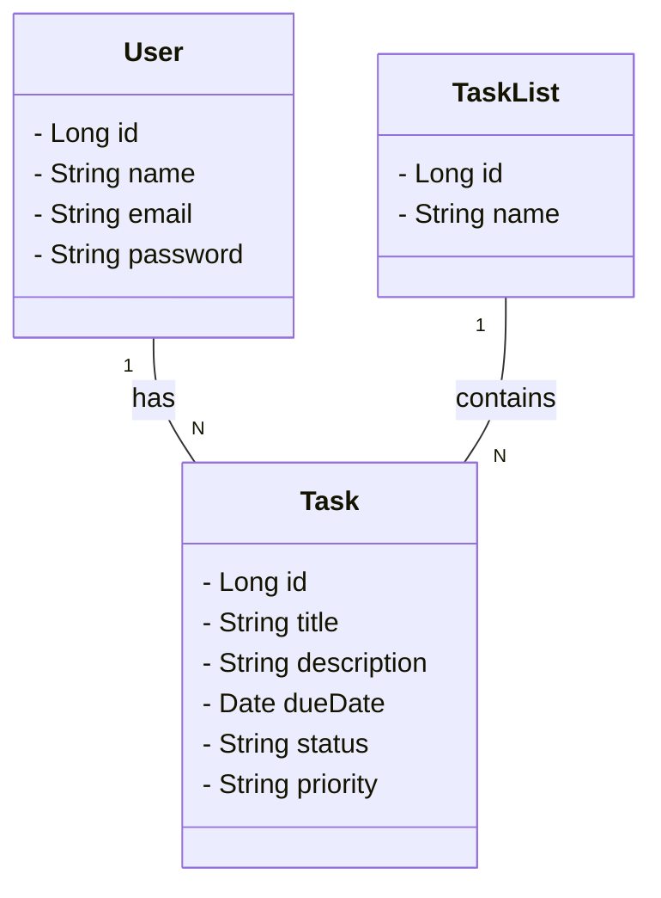

# TaskMaster
Task Management System with a Spring Boot RESTful API. This project enables users to efficiently create, organize, and track their tasks and task lists. It implements user authentication, task priorities, notifications, and more. A comprehensive solution for staying on top of your daily responsibilities

## Class Diagram

